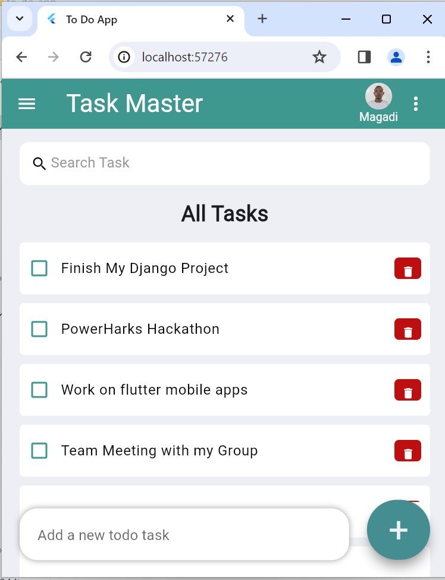
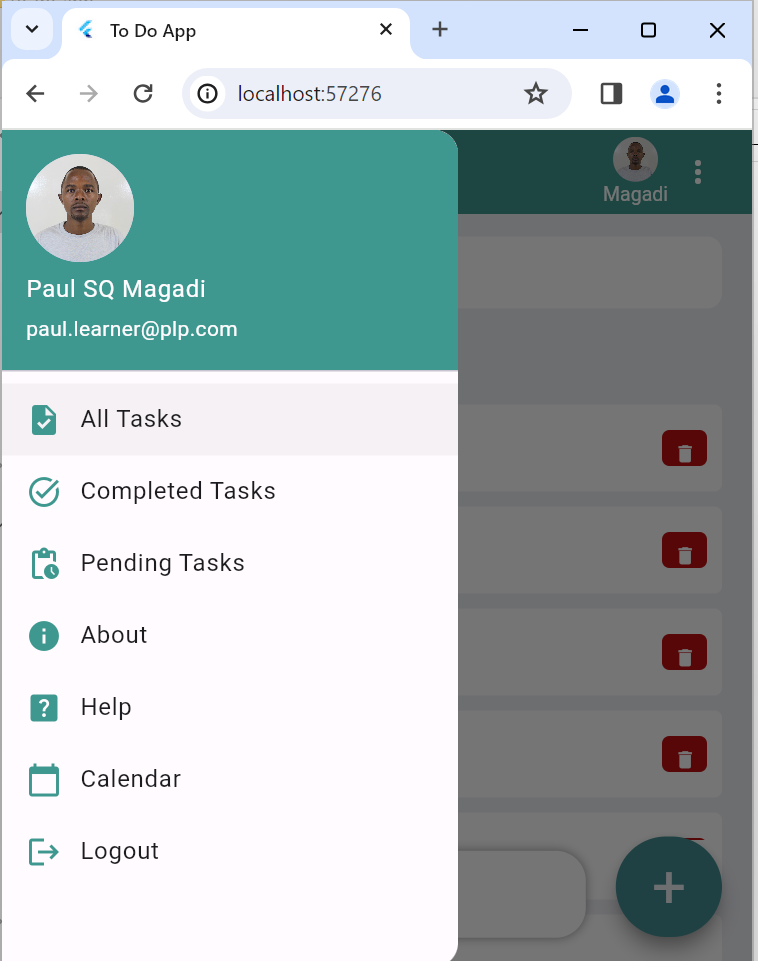
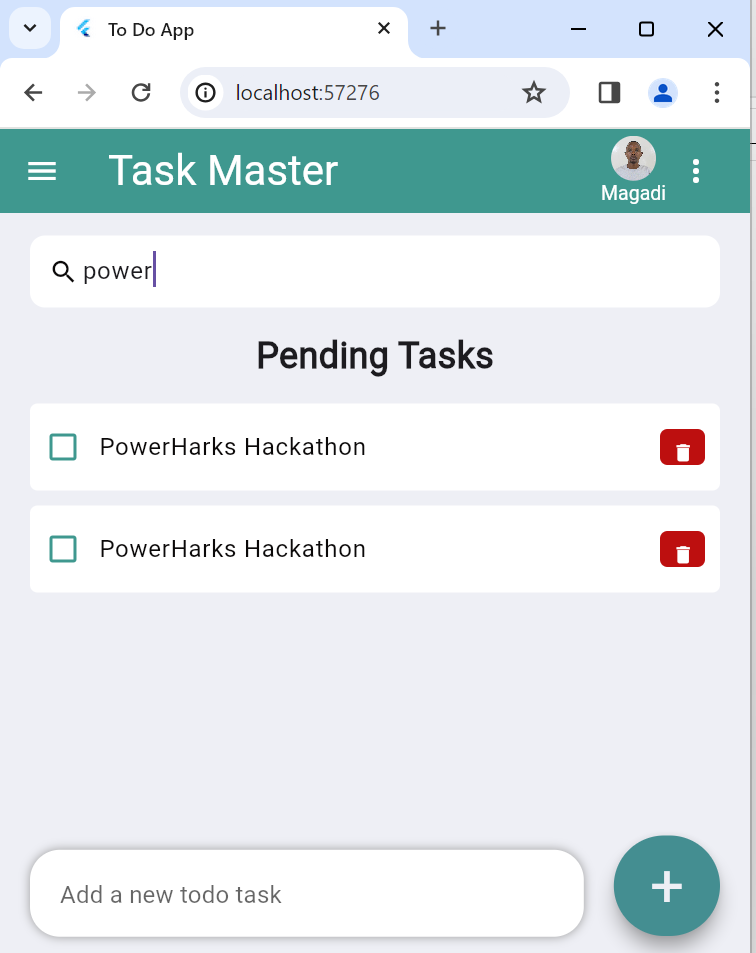
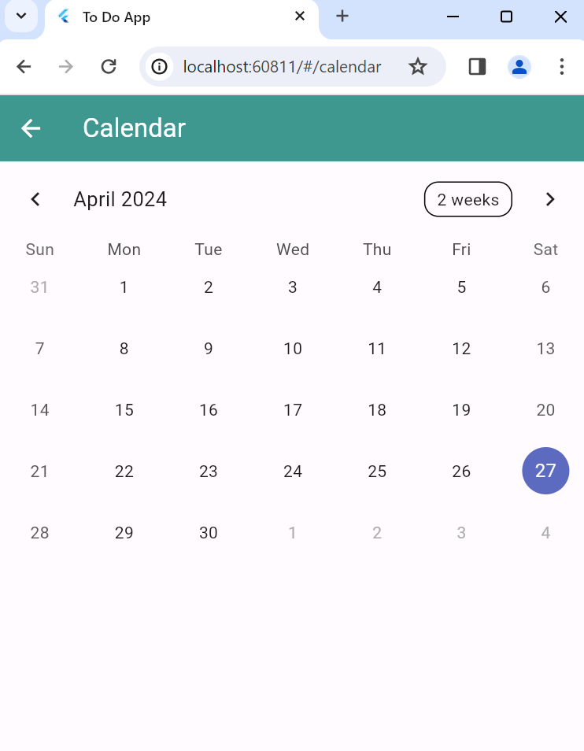
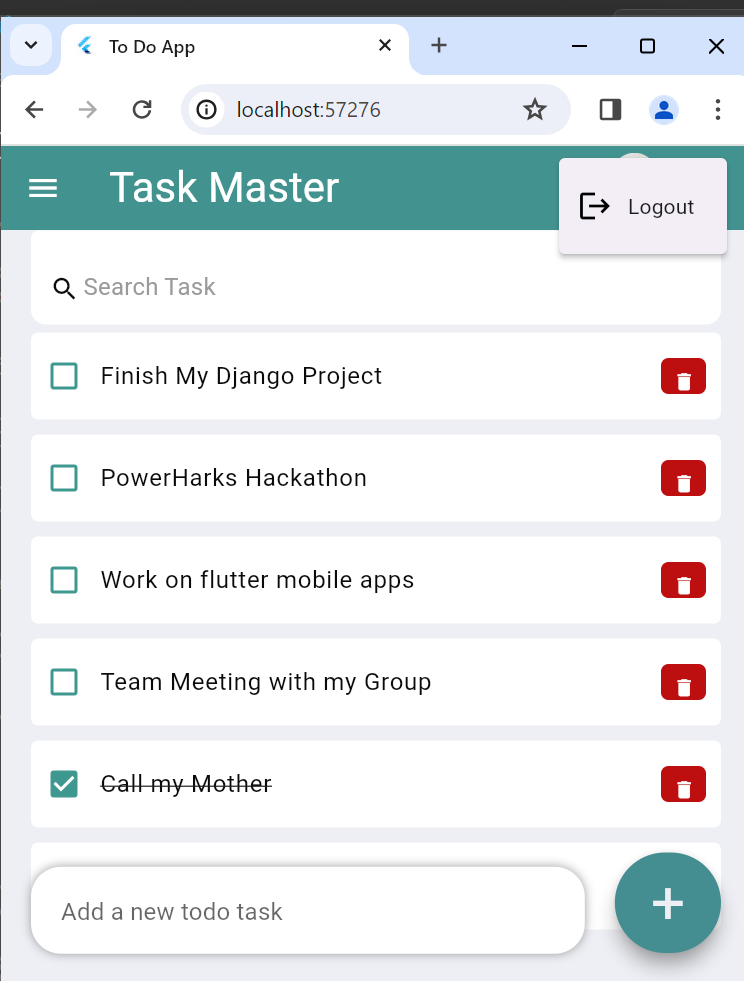
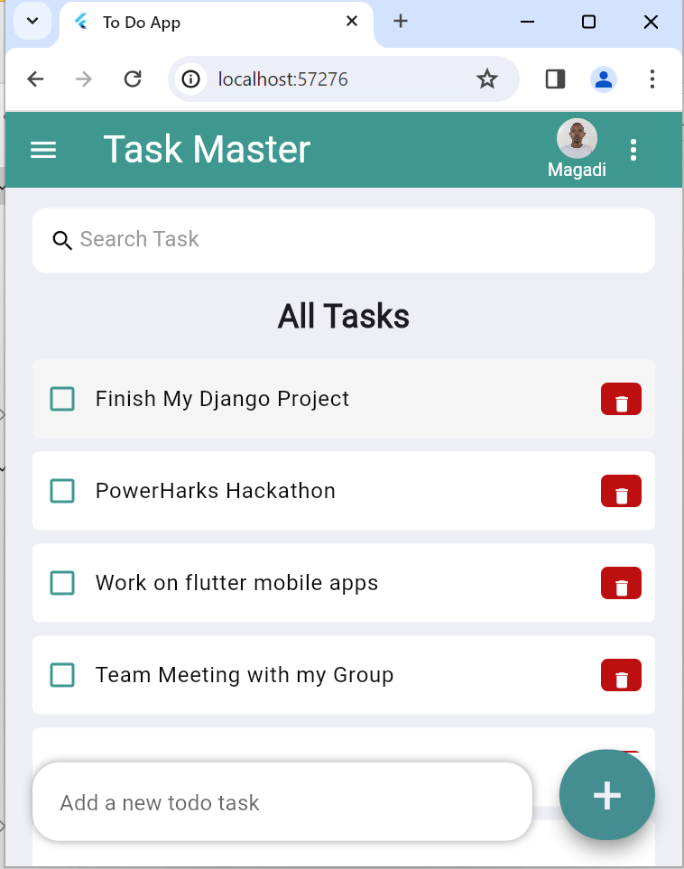
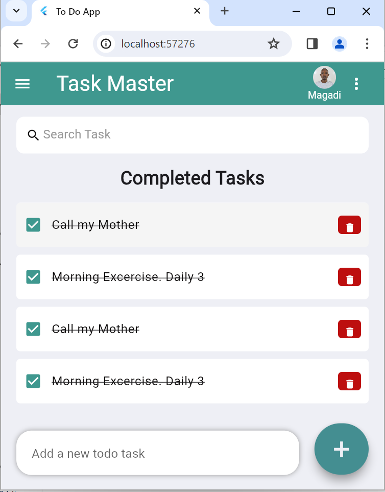
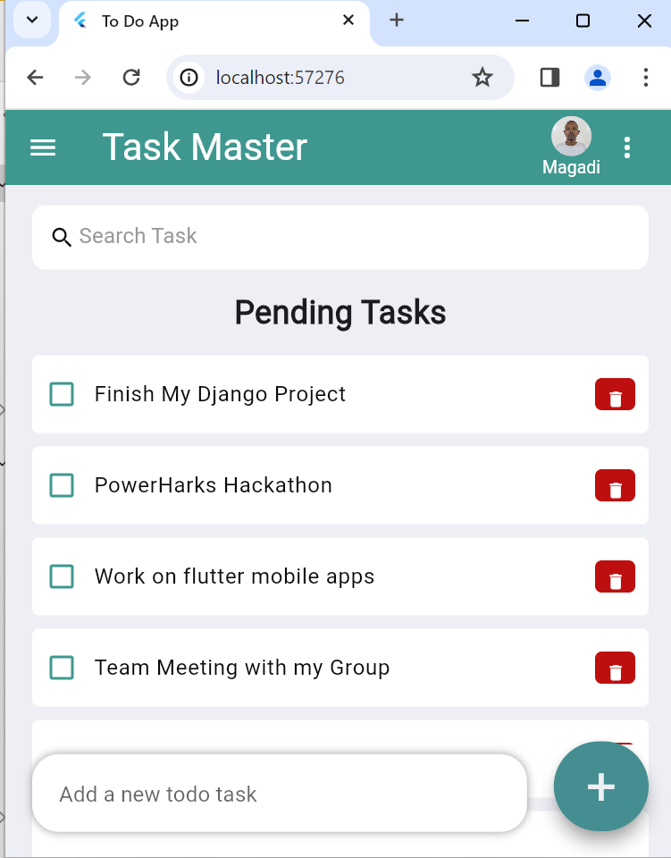
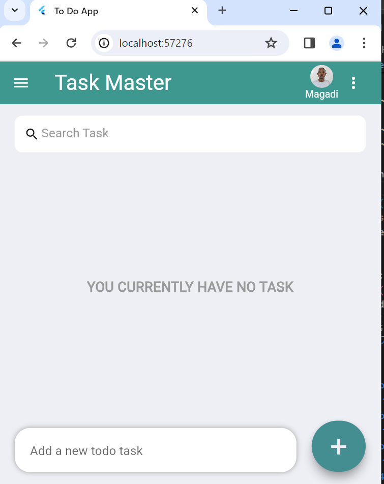
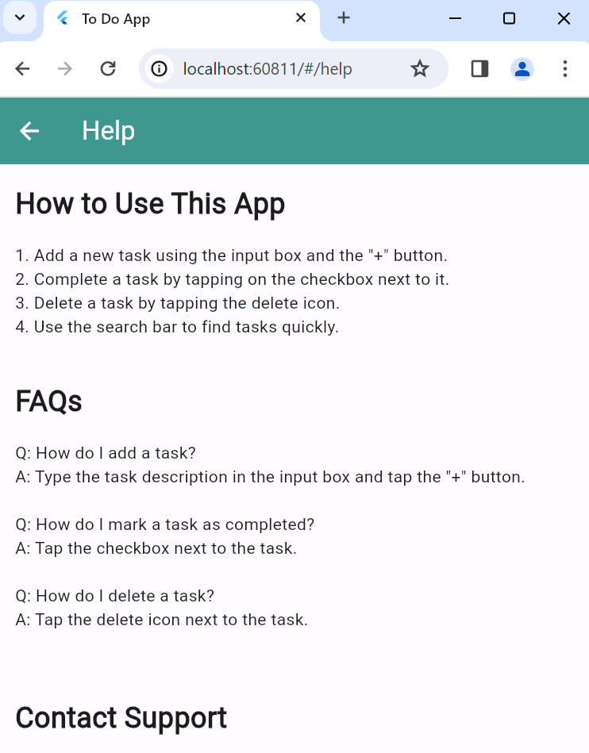

# Task Master
This is a simple ToDo app

Watch the illustration here:
[![Watch the Video Illustration]](https://www.loom.com/share/8ea5970c08da47a98f4fbb08b7984856?sid=8433374a-1083-4031-8de4-bb13d344ec90)

<iframe width="560" height="315" src="https://www.loom.com/share/8ea5970c08da47a98f4fbb08b7984856?sid=8433374a-1083-4031-8de4-bb13d344ec90" title="Watch the Video Illustration" frameborder="0" allow="accelerometer; autoplay; clipboard-write; encrypted-media; gyroscope; picture-in-picture" allowfullscreen></iframe>

## Home Screen

## About Screen

## Drawer

## Search Functionality

## Calender Screen

## Logout Menu

## All Task

## Completed Tasks

## Pending Tasks

## No Task

## Help Screen

